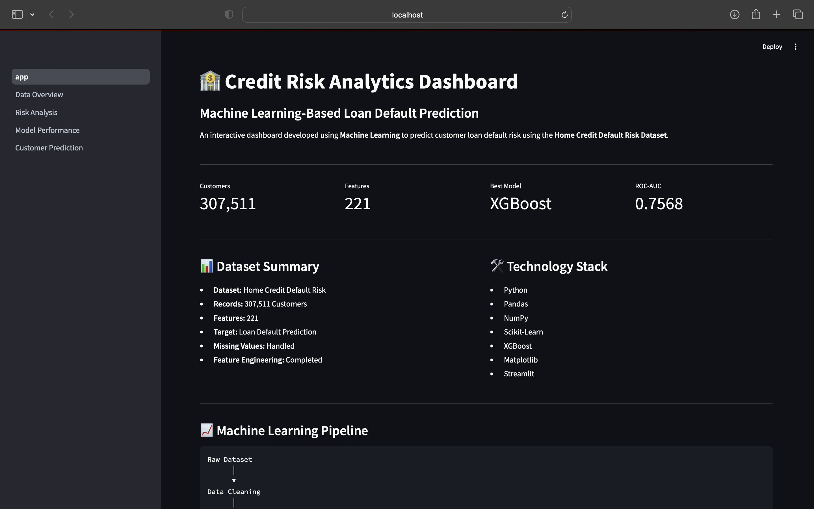
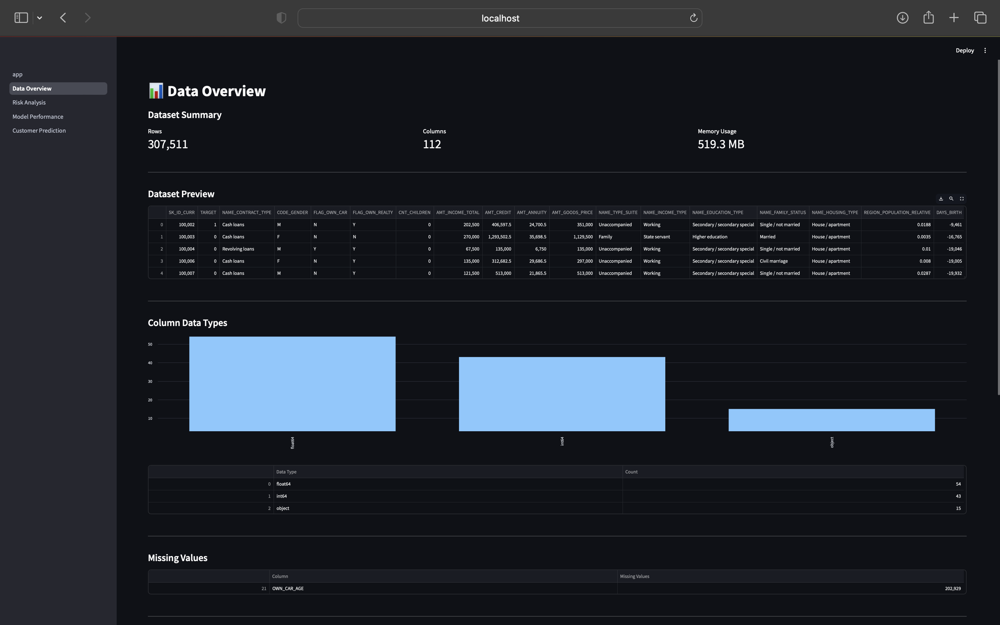
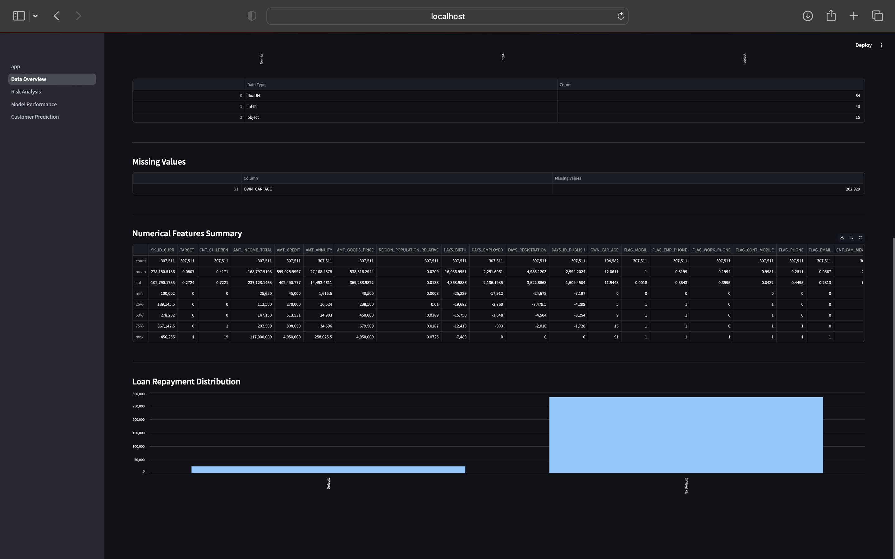
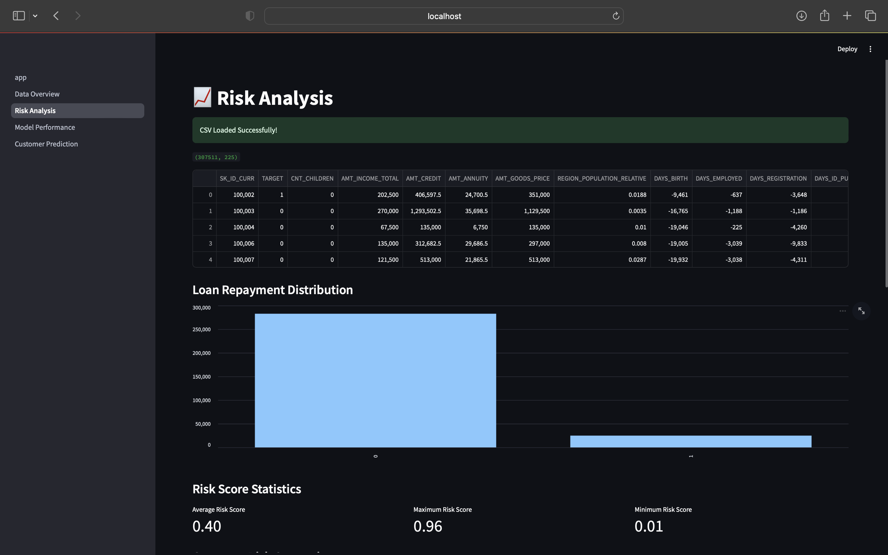
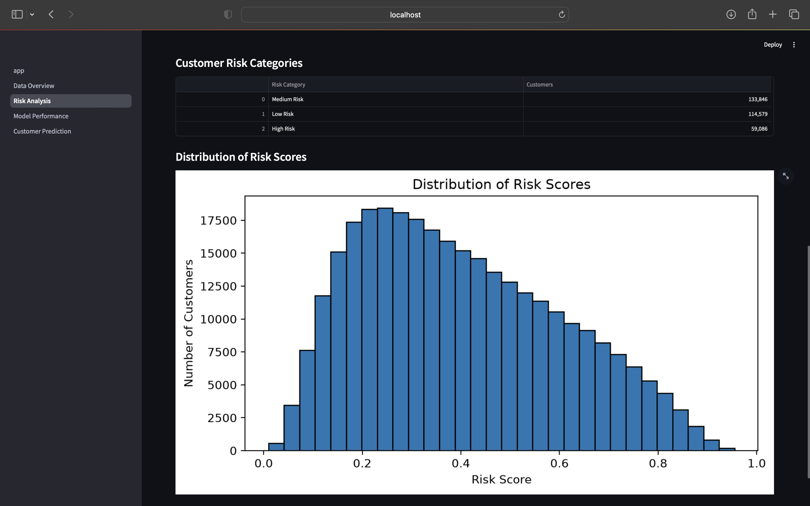
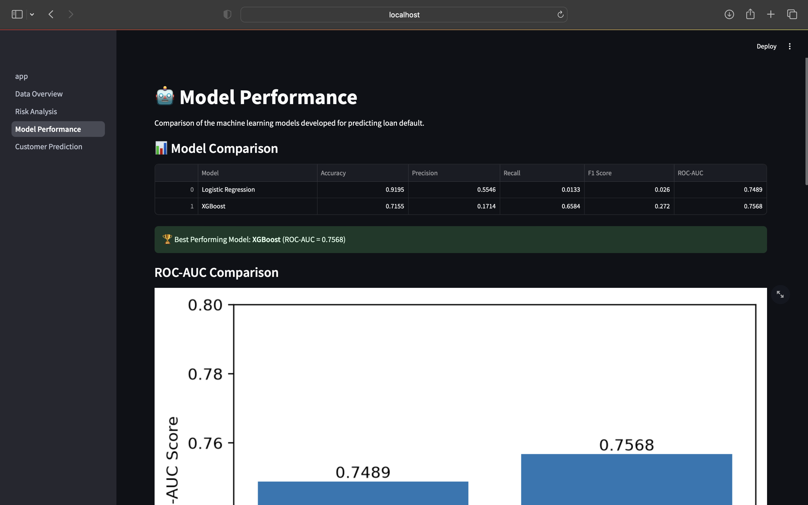
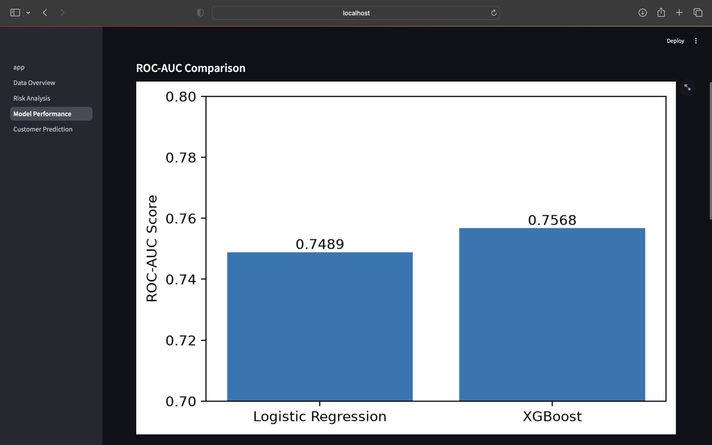
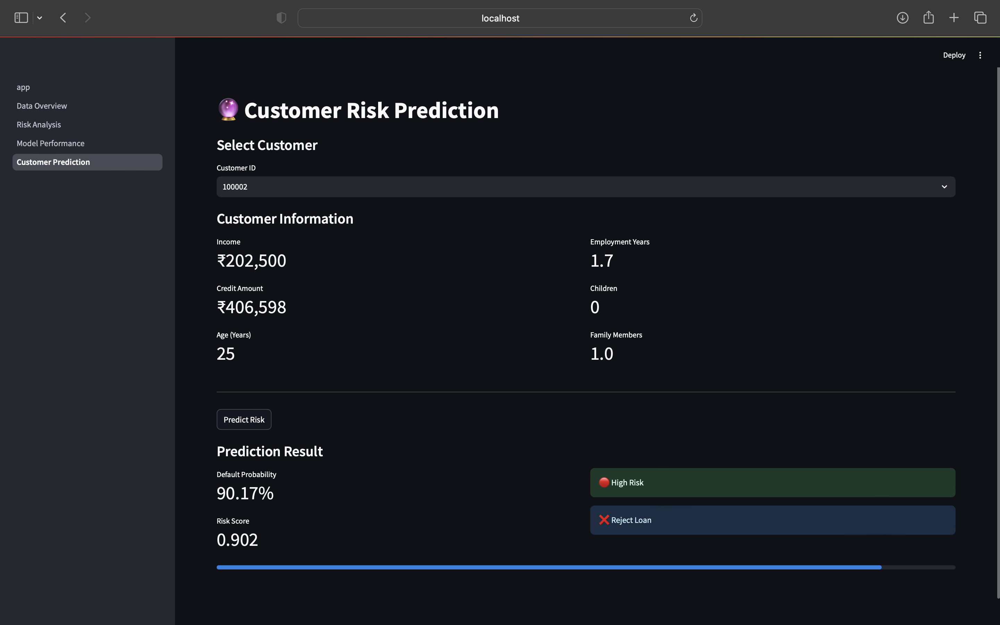

# 🏦 Credit Risk Analytics & Portfolio Optimization

> **Developed by Dhatri Mididuddi**  
> **Co-Founder & AI Engineer @ Atlas AI Labs**


An end-to-end Machine Learning project that predicts customer loan default risk and provides business insights through an interactive Streamlit dashboard.

> This project demonstrates an end-to-end machine learning workflow for credit risk assessment, showcasing data preprocessing, exploratory analysis, predictive modeling, business insights, and interactive dashboard development.

## 📊 Project Snapshot

| Metric | Value |
|---------|-------|
| 📁 Dataset | Home Credit Default Risk |
| 👥 Customers | 307,511 |
| 📊 Features | 225 |
| 🤖 Best Model | XGBoost |
| 🎯 ROC-AUC | **0.7568** |
| 🖥 Dashboard | Streamlit |

---
## 📑 Table of Contents

- Project Overview
- Business Problem
- Objectives
- Dataset
- Technology Stack
- Project Workflow
- Exploratory Data Analysis
- Machine Learning Models
- Model Performance
- Business Insights
- Interactive Dashboard
- Project Structure
- Running the Project
- Future Improvements
- Project Limitations
- Repository Features
- Author

---

## 📌 Project Overview

Financial institutions face significant losses due to loan defaults. Approving high-risk loan applications without proper risk assessment can increase non-performing assets and reduce profitability.

This project builds a complete **Credit Risk Analytics Pipeline** using the Home Credit Default Risk dataset. The solution combines data preprocessing, feature engineering, exploratory data analysis, machine learning, business insights, and an interactive Streamlit dashboard to help identify high-risk customers.

---

## 🎯 Business Problem

Banks receive thousands of loan applications every day.

The challenge is to determine:

- Which applicants are likely to repay the loan?
- Which applicants are at high risk of default?
- How can risk be quantified before approving a loan?

This project aims to answer these questions using machine learning.

---

## 🎯 Objectives

- Clean and preprocess real-world financial data
- Perform exploratory data analysis (EDA)
- Engineer meaningful risk-related features
- Train and evaluate multiple machine learning models
- Predict customer loan default probability
- Categorize customers into different risk levels
- Build an interactive dashboard for business users

---

## 📂 Dataset

**Dataset Name**

Home Credit Default Risk Dataset

**Source**

Kaggle – Home Credit Default Risk Competition

The dataset contains anonymized customer loan application records along with demographic, financial, and credit-related information.

### Dataset Summary

| Attribute | Value |
|-----------|------:|
| Customers | 307,511 |
| Original Features | 122 |
| Engineered Features | 225 |
| Target Variable | TARGET (Loan Default) |

---

## ⚠️ Dataset Availability

The datasets used in this project are **not included** in this repository because GitHub limits individual file sizes to **100 MB**, and the raw and processed datasets exceed this limit.

To reproduce the project:

1. Download the **Home Credit Default Risk** dataset from Kaggle:
   https://www.kaggle.com/competitions/home-credit-default-risk

2. Place the downloaded files inside:

```
data/raw/
```

3. Execute the notebooks in sequence to generate the processed datasets.

4. Finally, launch the Streamlit dashboard using:

```bash
streamlit run dashboard/app.py
```

---

## 🛠 Technology Stack

| Category | Technologies |
|----------|--------------|
| **Programming Language** | Python |
| **Data Processing** | Pandas, NumPy |
| **Data Visualization** | Matplotlib, Plotly |
| **Machine Learning** | Scikit-Learn, XGBoost |
| **Dashboard Development** | Streamlit |
| **Model Serialization** | Joblib |
| **Version Control** | Git, GitHub |
| **Development Environment** | Jupyter Notebook, VS Code |
| **Operating System** | macOS |

---

## 📈 Project Workflow

```
Raw Dataset
      │
      ▼
Data Cleaning
      │
      ▼
Exploratory Data Analysis
      │
      ▼
Feature Engineering
      │
      ▼
Machine Learning
      │
      ▼
Risk Prediction
      │
      ▼
Business Insights
      │
      ▼
Interactive Dashboard
```

---

## 📊 Exploratory Data Analysis

The project includes:

- Missing value analysis
- Loan default distribution
- Income analysis
- Credit amount analysis
- Age analysis
- Employment analysis
- Feature correlation analysis
- Customer segmentation
- Risk distribution analysis

---

## 🤖 Machine Learning Models

The following models were developed and evaluated:

- Logistic Regression
- XGBoost

Evaluation metrics include:

- Accuracy
- Precision
- Recall
- F1 Score
- ROC-AUC

---

## 📈 Model Performance

Two machine learning models were trained and evaluated for predicting customer loan default. Since the dataset is highly imbalanced, multiple evaluation metrics were considered instead of relying solely on accuracy.

| Model | Accuracy | Precision | Recall | F1 Score | ROC-AUC |
|:------|---------:|----------:|--------:|---------:|---------:|
| Logistic Regression | **91.95%** | 55.46% | 1.33% | 2.60% | 0.7489 |
| XGBoost | 71.55% | 17.14% | **65.84%** | **27.20%** | **0.7568** |

### 🏆 Best Performing Model

Although **Logistic Regression** achieved a higher overall accuracy (**91.95%**), it identified only **1.33%** of actual loan defaulters, making it unsuitable for credit risk prediction.

**XGBoost** significantly improved the model's ability to identify risky customers by achieving:

- ✅ Recall: **65.84%**
- ✅ F1 Score: **27.20%**
- ✅ Highest ROC-AUC: **0.7568**

Therefore, **XGBoost** was selected as the final model because correctly identifying high-risk borrowers is more important than maximizing overall accuracy in credit risk analysis.

--- 

## 📌 Business Insights

The exploratory analysis and machine learning models provided several valuable insights for financial institutions:

- Younger applicants exhibited a higher probability of loan default.
- Customers with lower annual income demonstrated greater financial risk.
- Applicants with a higher credit-to-income ratio were more likely to default.
- Longer employment history was generally associated with lower credit risk.
- Feature engineering improved the predictive capability of the models.
- XGBoost substantially outperformed Logistic Regression in identifying high-risk customers despite having lower overall accuracy.
- Prioritizing recall over accuracy enables financial institutions to detect a larger proportion of potential defaulters, helping reduce future financial losses.

---

## 📊 Interactive Dashboard

The Streamlit dashboard contains:

- 🏠 Home
- 📊 Data Overview
- 📈 Risk Analysis
- 🤖 Model Performance
- 🔮 Customer Risk Prediction

---

## 📷 Dashboard Preview

### 🏠 Dashboard Home



---

### 📊 Data Overview (Part 1)



### 📊 Data Overview (Part 2)



---

### 📈 Risk Analysis (Part 1)



### 📈 Risk Analysis (Part 2)



---

### 🤖 Model Performance (ROC-AUC Comparison)



### 🤖 Model Performance (Evaluation Metrics)



---

### 🔮 Customer Risk Prediction


---

## 📁 Project Structure

```
Credit-Risk-Analytics/

├── dashboard/
│   ├── app.py
│   └── pages/
│
├── notebooks/
│
├── models/
│
├── src/
│
├── data/
│   ├── raw/
│   └── processed/
│
├── requirements.txt
├── README.md
└── .gitignore
```

---

## ✨ Project Highlights

- End-to-end Machine Learning project from data preprocessing to deployment-ready dashboard.
- Processed and analyzed over **307,000** customer loan records.
- Engineered additional features to improve predictive performance.
- Built an interactive Streamlit dashboard for business users.
- Compared multiple machine learning models using industry-standard evaluation metrics.
- Generated customer-level risk scores and categorized borrowers into different risk groups.

---

## 🚀 Running the Project

Clone the repository

```bash
git clone https://github.com/Nitishkumar1412/Credit-Risk-Analytics.git
```

Move into the project

```bash
cd Credit-Risk-Analytics
```

Create a virtual environment

```bash
python -m venv .venv
```

Activate the virtual environment

macOS/Linux

```bash
source .venv/bin/activate
```

Windows

```bash
.venv\Scripts\activate
```

Install dependencies

```bash
pip install -r requirements.txt
```

Run the dashboard

```bash
streamlit run dashboard/app.py
```

---

## 🔮 Future Improvements

- Deploy the dashboard using Streamlit Community Cloud.
- Perform advanced hyperparameter tuning using Optuna or GridSearchCV.
- Integrate SHAP values for model explainability.
- Develop a real-time prediction API using FastAPI.
- Automate the data preprocessing pipeline.
- Incorporate macroeconomic indicators for improved prediction accuracy.
- Enable periodic model retraining using newly available customer data.

---

## ⚠️ Project Limitations

- The dataset is highly imbalanced, making customer default prediction particularly challenging.
- Customer information is anonymized, limiting feature interpretability.
- Hyperparameter tuning was limited to reduce computational complexity.
- External economic indicators (e.g., inflation, unemployment, interest rates) were not incorporated.
- The dashboard currently relies on preprocessed datasets rather than a live production database.
- Model predictions should support business decision-making and should not replace expert financial evaluation.
---

## 📚 Repository Features

- Well-structured project organization
- Reproducible machine learning pipeline
- Comprehensive documentation
- Interactive Streamlit dashboard
- Business-oriented insights and visualizations
- Clean and modular Python code

---

## 👩‍💻 Author

**Nitish Kumar**

Btech. Computer Science & Engineering (AI & ML)  
Sharda University, Greater Noida

- GitHub: https://github.com/Nitishkumar1412
- LinkedIn: https://www.linkedin.com/in/nitish-kumar-2908sv1412/
---

⭐ If you found this project useful, consider giving the repository a star.
      